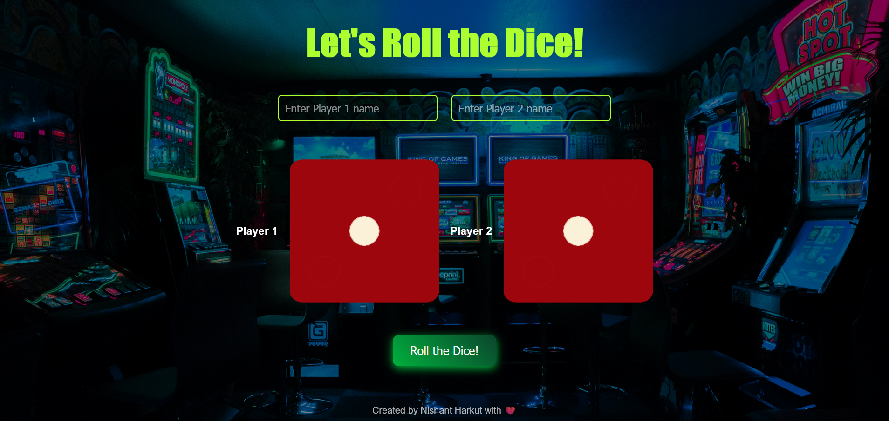

# 🎲 Dice Game

This is a fun, interactive web-based dice game where two players roll virtual dice and see who wins. The game allows users to input player names and roll the dice by clicking a fancy button. The results are displayed along with a custom dialog showing the winner.

 <!-- Optional: Add a screenshot of your game -->

## 🚀 Technologies Used
- **HTML5**: Markup structure of the web page.
- **CSS3**: For styling, animations, and responsiveness.
- **JavaScript**: For game logic, including dice rolling and winner determination.

## 🛠️ Features
- **Responsive Design**: Works smoothly on all devices including phones, tablets, and desktops.
- **Player Name Input**: Users can input names for Player 1 and Player 2.
- **Fancy Dice Roll Button**: A visually appealing button triggers the dice roll.
- **Animated Dice and Results**: Dice images rotate and bounce on hover, with results displayed in a custom dialog box.
- **Randomized Dice Rolls**: The dice rolls are randomized for each player.
- **Winner Dialog**: The game announces the winner in a pop-up dialog.


## 📦 How to Run the Game Locally

1. **Clone the repository**:
   ```bash
   git clone https://github.com/your-username/dice-game.git

2. **Navigate to the project directory**:
   ```bash
   cd dice-game 

3. Open the index.html file in your browser:
   ```bash
   open index.html or simply drag and drop the index.html file into your browser

## 🎮 How to Play 
- **Enter the Player Names:** Enter names for Player 1 and
Player 2 in the provided input fields.
- **Roll the Dice:** Click the \"Roll the Dice!\" button to roll the dice for both the players.
- **Check the Winner:** After rolling, a dialog box will appear showing who won the game or if it was a tie.

- **Refresh Option 🔃:** If you want to start over, just refresh the page to reroll.

## 🎨 UI/UX Highlights

- **Dynamic Dice Images:** Dice update dynamically on each roll.
- **Button Animation:** Hover effects enhance engagement.
- **Winner Announcement:** Exciting modal displays the winner.

## 🤝 Contributing
Feel free to submit a pull request to contribute or fix issues!

## 📄 License 
Licensed under the MIT License.
##
## 👨‍💻 Created by Nishant Harkut with ❤️
##
